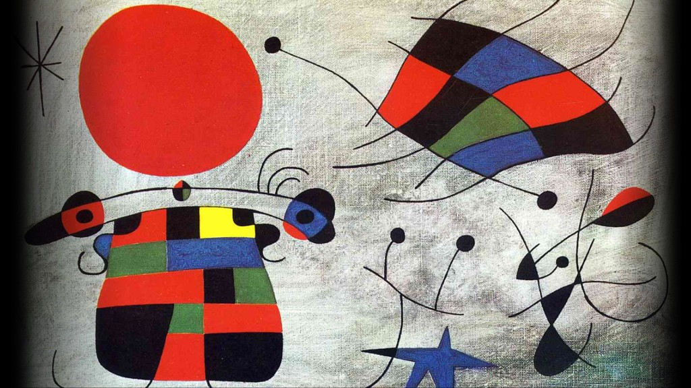

# A-frame
This is  a repo for our CM 2700 AFRAME Project!

The final animation is the file "arranged.html" accessed at https://ardenwd.github.io/A-frame/arranged.html

We based this project on *The Smile of the Flamboyant Wings,* 1953 by Joan Miro.

